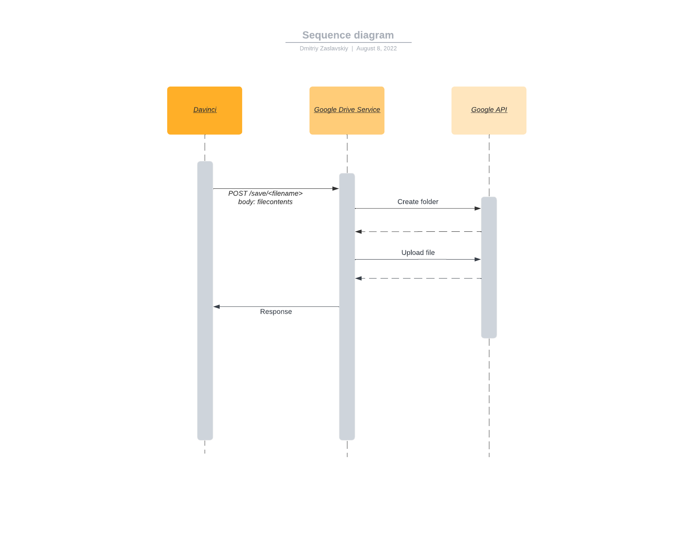

# Data Retention

To facilitate better data analysis for Equity Study a system to retain PII after the end of a flow is needed. The IDVA system is designed to avoid the retention of PII so an external system will be used instead. The GSA Google Drive will be used to store the data. This will require a service to intermediate between IDVA Davinci and Google's api.

## Microservice

A microservice will talk to the google api to store the data and expose an endpoint for flows to talk to.

### Authentication

The microservice will authenticate to Google's Drive api using a Google cloud service account that has been granted access to the drive folder where the data is stored. Within IDVA, access to the microservice is controlled at the network level.

## Data Layout

The data will be stored in with a path of `/EquityStudy/<interactionId>/<filename>`.
It would be expected that each folder contains a json file and multiple image files.

* GSA Google Drive Shared Location
    * EquityStudy
        * `<interactionId>`
            * Image.png
            * Data.json

## SSP Changes

The current SSP does not permit storing PII data beyond the scope of the flow. After introducing this change, the SSP must reflect that PII will be stored for some period of time in Google Drive. This is an external system to IDVA so it will not impact the controls specifying the treatment of PII within IDVA.